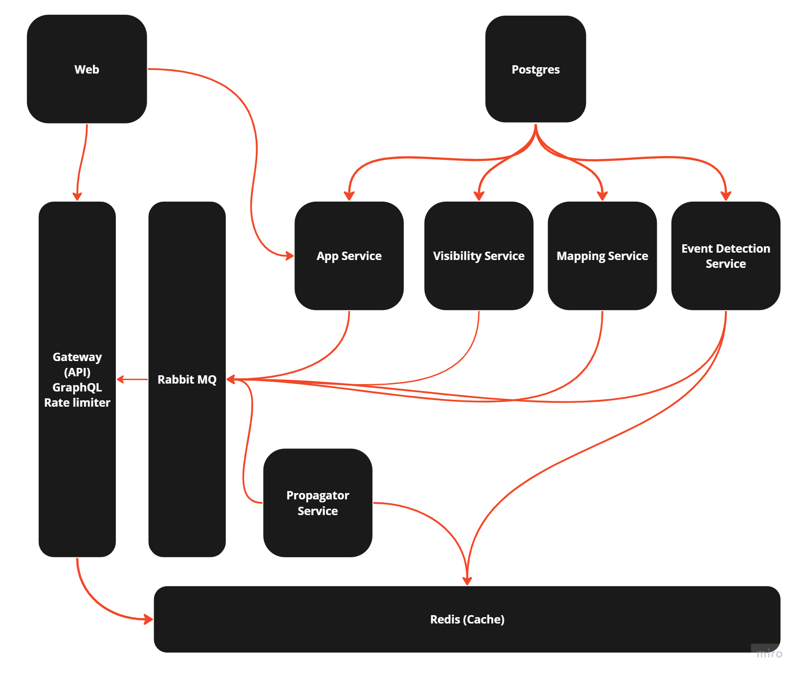
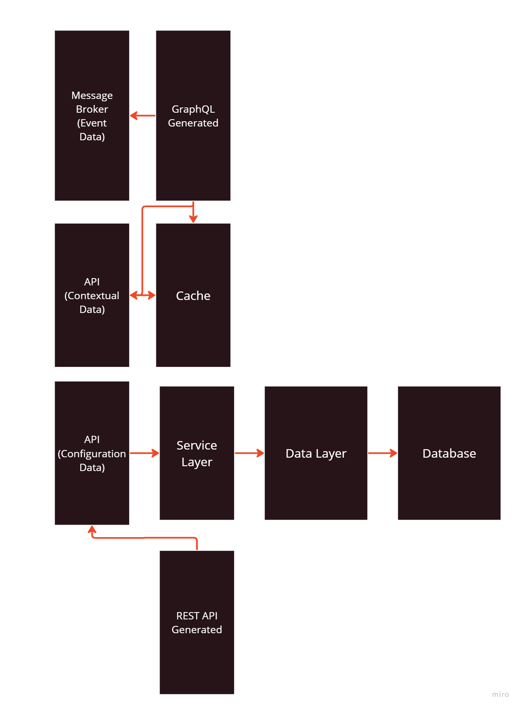

# Project 2112


[](https://github.com/Elbujito/2112/actions/workflows/go.yml)
[](https://goreportcard.com/report/github.com/Elbujito/2112)
[](https://github.com/Elbujito/2112/actions/workflows/codeql.yml)
[](https://github.com/Elbujito/2112/actions/workflows/codacy.yml)
[](https://gist.github.com/cheerfulstoic/d107229326a01ff0f333a1d3476e068d)

# Getting Started



## Project Overview

Project 2112 is a comprehensive system designed to track and visualize the positions of satellites and debris in real-time. The architecture leverages a combination of microservices, a GraphQL gateway, and a frontend application to provide a seamless user experience.

## Project Structure

This project is managed using **Nx**, a set of Extensible Dev Tools for Monorepos, which helps in managing the dependencies and build processes efficiently.

### Directory Structure

- **assets/grafana/provisioning**: Contains configuration files for Grafana provisioning, including dashboards and data sources.
  - **dashboards**: Configuration files for various Grafana dashboards.

- **deployments**: Contains Docker Compose files and configurations for deploying the services.
  - **compose**: Docker Compose files for different services.
  - **config/docker**: Dockerfiles for different services.

- **docs**: Contains documentation for the project.
  - **lab/tle-propagator-service**: Source code and configuration for POC.

- **org**: The Nx workspace directory containing the different projects and their dependencies.
  - **nx**: Nx configuration and workspace files.

### Nx Workspace

The Nx workspace is organized into several projects, each with its specific role and dependencies:

- **app-service**: A backend application responsible for handling core business logic.
  - Dependencies: `go-utils`, `graphql-api`
- **gateway-service**: A backend application that serves as the GraphQL gateway.
  - Dependencies: `go-utils`, `graphql-api`
- **go-utils**: A library containing utility functions for backend services.
  - Tags: `backend`, `golang`, `library`
- **graphql-api**: A library containing the GraphQL schema and resolvers.
  - Tags: `backend`, `graphql`, `schema`
- **propagator-service**: A backend library responsible for propagating satellite positions.
  - Dependencies: `graphql-api`
  - Tags: `backend`, `python`
- **web**: A frontend application built with React for visualizing satellite data.
  - Dependencies: `graphql-api`
  - Tags: `frontend`, `react`



## Prerequisites

- **Docker** and **Docker Compose** installed on your machine.
- **Node.js** and **npm** installed (for running Nx commands).

## Getting Started

1. Clone this repository:
   ```bash
   git clone git@github.com\:elbujito/2112.git
   cd org
   ```

2. Install the dependencies:

   ```bash
   npm install
   ```

3. Run the development server:
   ```bash
   nx serve web
   ```

4. Run the backend services:
   ```bash
   nx serve app-service
   nx serve gateway-service
   ```

5. Run the propagator service:
   ```bash
   nx serve propagator-service
    ```

6. List available routes using:
   ```bash
   nx info protected-api-routes
   ```

7. Use your favorite API client to test the endpoints or use the following commands to get started and ensure everything is up and running:

   ```bash
   curl -H "Accept: application/json" http://127.0.0.1:8081/health/alive
   curl -H "Accept: application/json" http://127.0.0.1:8081/health/ready
   ```

## GraphQL Gateway Setup
This repository sets up a GraphQL Gateway service implemented in Go, which interacts with a Redis service for Pub/Sub messaging. The setup is containerized using Docker and managed with Docker Compose.

## Project Structure
- GraphQL Gateway (Go): A GraphQL API for querying satellite position data.
- Redis Service: Used for Pub/Sub messaging between services.
- Docker Compose: Manages and orchestrates the services.

## Operations
For more details on running and using the service, scroll down to the "Operations" section.